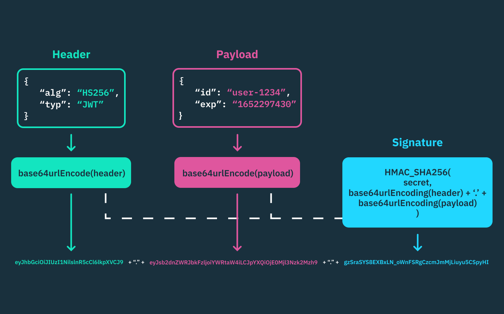

# Лекция 5: Идентификация, Аутентификация и Авторизация

## Структура занятия (90 минут)

### Блок 1: Основные понятия (15 минут)

**Три кита безопасности:**

1. **Идентификация** - "Кто ты?"
   - Пользователь заявляет, кто он (логин, email, ID)
   - Просто называет себя

2. **Аутентификация** - "Докажи, что это ты"
   - Проверка личности (пароль, биометрия, токен)
   - Подтверждение заявленной идентичности

3. **Авторизация** - "Что тебе можно?"
   - Проверка прав доступа
   - Определение разрешенных действий

**Задание:** Приведите примеры из реальной жизни для каждого понятия?

---

### Блок 2: Методы аутентификации (25 минут)

#### 2.1 Basic Auth
- Логин + пароль в каждом запросе
- Header: `Authorization: Basic base64(login:password)`

**Плюсы:**
- Простота реализации
- Stateless (не требует состояния на сервере)
- Работает везде (curl, мобильные, Postman)

**Минусы:**
- Невозможно отозвать доступ между запросами
- Credentials в каждом запросе
- Нет session timeout

**Используйте:** Внутренние API сервисов, интеграции компании, CLI утилиты

**НЕ используйте:** Веб-приложения, мобильные приложения, публичные API

**Задание:** Где еще используется Basic Auth? (API ключи, внутренние сервисы)

**Пример:** [examples/01-basic-auth](examples/01-basic-auth)

**Как тестировать:**
```bash
# С правильными credentials
curl -u admin:secret http://localhost:8080/protected

# Или с заголовком
curl -H "Authorization: Basic YWRtaW46c2VjcmV0" http://localhost:8080/protected
```

**Задание:** Почему Basic Auth опасно использовать без HTTPS?

#### 2.2 Session-based (Cookie)
- Сервер создает сессию после логина, хранит в Redis/БД
- Клиенту отправляется session_id в cookie (HttpOnly, Secure, SameSite=Lax/Strict)
- При каждом запросе сервер проверяет session_id и загружает данные пользователя

**Генерация Session ID:**
- Криптографически случайная строка: `crypto/rand` → base64 (минимум 32 байта)
- UUID v4 НЕ использовать (не криптографически безопасный)
- Сервер хранит как ключ в Redis/БД, значение - user_id + метаданные

**Безопасность:**
- HttpOnly защищает от XSS, SameSite=Lax/Strict - от CSRF
- CSRF токены для state-changing операций (POST/PUT/DELETE)
- Подделка ID бесполезна - сервер не найдет в хранилище

**Плюсы:**
- Мгновенный разлог/блокировка (удаление из БД)
- Session timeout и отслеживание активности
- Credentials не передаются после логина

**Минусы:**
- Требует БД для хранения (стандарт - Redis)
- В распределенной системе: shared Redis или шардирование с маршрутизацией
- Cookies привязаны к домену (cross-domain требует настройки)

**Используйте:** Традиционные веб-приложения (аля Django), когда нужен быстрый разлог и контроль сессий

**НЕ используйте:** Мобильные приложения, публичные REST API

**Пример:** [examples/02-session-auth](examples/02-session-auth)

#### 2.3 Token-based (JWT)
- Сервер создает подписанный токен после логина
- Клиент хранит токен (localStorage/cookie/secure storage) и отправляет в заголовке `Authorization: Bearer <token>`
- Токен содержит данные пользователя (claims) в payload
- Stateless - сервер не хранит сессии, проверяет только подпись токена

**JWT структура:**
```
header.payload.signature
```
- Header: алгоритм подписи (HS256, RS256)
- Payload: данные (user_id, roles, exp, iat)
- Signature: HMAC или RSA подпись для проверки целостности



**Безопасность:**
- Токен подписан секретным ключом (HS256) или приватным ключом (RS256)
- Expiration (exp) - обязателен для ограничения времени жизни
- Refresh tokens для обновления access token без повторного логина
- Хранение: HttpOnly cookie безопаснее localStorage (защита от XSS)

**Плюсы:**
- Stateless - не требует хранилища на сервере, легко масштабируется
- Работает везде: браузеры, мобильные, CLI, микросервисы
- Содержит данные пользователя - не нужен запрос к БД при каждом запросе

**Минусы:**
- Невозможно мгновенно отозвать доступ (до истечения exp) без blacklist/refresh token revocation
- Размер токена больше чем session_id (передается в каждом запросе)
- Refresh token rotation усложняет реализацию

**Используйте:** Мобильные приложения, публичные REST API, микросервисы, SPA, когда нужна stateless архитектура

**НЕ используйте:** Когда нужен мгновенный разлог без blacklist, традиционные серверные приложения с SSR

**Пример:** [examples/03-jwt-auth](examples/03-jwt-auth)

**Задание:** В чем главное отличие JWT от сессий? (stateless vs stateful)

---

### Блок 3: SSO и OAuth 2.0 / OIDC (15 минут)

#### 3.1 Single Sign-On (SSO)
**Концепция:**
- Один раз авторизовался - доступ ко всем сервисам
- Примеры: "Войти через Google", корпоративные системы
- Централизованное управление пользователями

**Проблема, которую решает SSO:**
- У компании 10 сервисов → 10 пар логин/пароль
- SSO → 1 пара логин/пароль для всех сервисов

**Задание:** Где вы встречали SSO? Google (Gmail → YouTube → Google Drive), Яндекс (Карты, Такси, Маркет, ...), Вк, Сбер, Apple, ....

#### 3.2 OAuth 2.0 и OpenID Connect (OIDC)

**OAuth 2.0** - протокол авторизации (делегирование доступа к ресурсам)
**OIDC** - протокол аутентификации поверх OAuth 2.0 (узнать кто пользователь)

**Базовый флоу (Authorization Code):**
```
1. Пользователь → Ваше приложение → "Войти через Google"
2. Редирект на Google (Authorization Server)
3. Пользователь вводит логин/пароль на Google
4. Google → редирект обратно с authorization code
5. Ваше приложение (back-channel) → POST /token на Google с code
   → Получает access_token (+ id_token для OIDC)
6. OAuth 2.0: используете access_token в заголовке Authorization: Bearer <token>
   → API ресурсов проверяет токен (introspection endpoint или JWT signature)
   → Доступ к данным пользователя (email, профиль и т.д.)
7. OIDC: используете id_token (JWT) - расшифровываете payload
   → Проверяете подпись (публичный ключ от Authorization Server)
   → Проверяете claims (iss, aud, exp, sub)
   → Получаете данные пользователя из payload (sub, email, name и т.д.)
```

#### 3.3 Keycloak - готовое решение для SSO

**Что такое Keycloak:**
- Open-source Identity and Access Management
- Реализует OAuth 2.0, OIDC, SAML
- Готовая админка для управления пользователями
- Поддержка ролей, групп, федерации

**Зачем нужен Keycloak:**
- Не нужно писать логику аутентификации с нуля
- Централизованное управление пользователями для всех сервисов
- Готовая интеграция с LDAP/Active Directory
- Поддержка социальных провайдеров (Google, VK, Yandex)
- Two-Factor Authentication (2FA) из коробки
- Single Sign-On / Single Sign-Out
- Аудит и логирование входов

**Кто использует Keycloak в России:**
- Сбер (для внутренних корпоративных систем)
- Ростелеком (управление доступом к сервисам)
- Яндекс (для некоторых внутренних систем)
- МТС (корпоративный SSO)
- Множество государственных порталов

**Пример интеграции:** [examples/04-keycloak-oidc](examples/04-keycloak-oidc) (Google OAuth/OIDC)

**Когда использовать Keycloak:**
- Много микросервисов → единая аутентификация
- Нужна интеграция с LDAP/Active Directory
- Требуется социальная авторизация
- Нужна готовая админка пользователей
- Требуется 2FA
- Хотите сэкономить время на разработке

**Задание:** Зачем нужен SSO, если можно просто сделать одну базу пользователей?

---

### Блок 4: Авторизация (Role-Based Access Control) (10 минут)

**RBAC (Role-Based Access Control)** - управление доступом на основе ролей

**Основные концепции:**
- Пользователь имеет одну или несколько ролей
- Роль определяет набор разрешений
- Проверка прав доступа перед выполнением действия

**Пример:** [examples/05-rbac](examples/05-rbac)

**RBAC в Keycloak:**
- Роли определяются в Keycloak
- Приходят в JWT токене в поле `roles`
- Приложение просто проверяет наличие роли

---

### Блок 5: Аутентификация между сервисами (HMAC) (10 минут)

**Разница между аутентификацией пользователей и сервисов:**
- JWT, сессии, Basic Auth - аутентификация **пользователей**
- HMAC - аутентификация **сервисов** (service-to-service)

#### 5.1 Что такое HMAC?

**HMAC (Hash-based Message Authentication Code)** - криптографическая подпись запроса с использованием общего секретного ключа.

**Что доказывает HMAC:**
1. Запрос пришел от того, кто знает секретный ключ
2. Данные не были изменены по пути

**Принцип работы:**
```
HMAC = hash(secret_key + message)
```

#### 5.2 Где используется HMAC?

- **API между микросервисами** (когда нет OAuth)
- **Webhook'и** - GitHub, Stripe отправляют HMAC подпись
- **Платежные системы** - проверка, что callback пришел от банка
- **IoT устройства** - аутентификация устройств

**Пример из жизни:**
Stripe отправляет webhook о платеже с HMAC подписью. Вы проверяете подпись своим секретным ключом и понимаете, что запрос действительно от Stripe, а не от злоумышленника.

**Пример:** [examples/06-hmac-auth](examples/06-hmac-auth)

#### 5.3 Важные детали HMAC

**Защита от replay-атак:**
- Включаем timestamp в подпись
- Проверяем, что запрос не старше N минут
- Можно также использовать nonce (уникальный ID запроса)

**Что подписывать:**
```go
// Вариант 1: Только тело запроса + timestamp
message = body + timestamp

// Вариант 2: Метод + URL + тело + timestamp (более безопасно)
message = method + url + body + timestamp

// Вариант 3: Все важные заголовки
message = method + url + headers + body + timestamp
```

**Где хранить секретный ключ:**
- Переменные окружения
- Секреты в Kubernetes/Docker
- Vault или другие системы управления секретами
- **Никогда** в коде!

#### 5.4 HMAC vs JWT для сервисов

**HMAC:**
- Проще и быстрее
- Симметричное шифрование (один ключ)
- Хорошо для доверенных сервисов

**JWT:**
- Содержит данные о сервисе/пользователе
- Может использовать асимметричное шифрование (публичный/приватный ключ)
- Лучше для распределенных систем

**Задание:** В каких случаях лучше использовать HMAC, а в каких JWT для межсервисного взаимодействия?

**Когда использовать HMAC:**
- Простая архитектура (2-3 сервиса)
- Все сервисы под вашим контролем
- Нужна максимальная производительность
- Webhook'и от внешних сервисов

**Когда JWT лучше:**
- Микросервисная архитектура (10+ сервисов)
- Разные команды разрабатывают сервисы
- Нужна передача данных в токене
- OAuth 2.0 между сервисами

---

### Блок 6: Безопасность (5 минут)

**Важные моменты:**
- Всегда используйте HTTPS
- Хешируйте пароли (bcrypt лучше sha256)
- HttpOnly cookies против XSS
- CSRF защита для cookie-based auth
- Rate limiting для /login
- Логирование попыток входа
- В OAuth/OIDC используйте параметр `state` для защиты от CSRF
- Для HMAC - проверяйте timestamp против replay-атак

**Задание:** Что такое CSRF и как от него защититься?

---

## Домашнее задание

### ДЗ 5 (Дедлайн: 19 ноября)
Реализовать модель данных, структуру, которая будет описывать базу данных. Нужно, чтобы было хотя бы 2 таблицы, отличных от модели User.

В данном задании должна быть реализована вся модель данных приложения (все сущности, связи между ними). Создана админка для их управления.

### ДЗ 6 (Дедлайн: 26 ноября)
Реализовать все апи-методы (без авторизации).

В данном задании должны быть реализованы все api-методы, которые будут использоваться на странице, кроме методов авторизации.

### ДЗ 7 (Дедлайн: 10 декабря)
Собрать бекенд + frontend (с авторизацией).

В данном задании должен быть реализован весь проект, с соединенным frontend + backend, авторизация, frontend должен общаться с бекендом без mock-сервера.

### ДЗ 8 (Дедлайн: 17 декабря)
Развернуть сервер.

В данном задании проект должен быть развернут на сервере (frontend + backend). Статика должна отдаваться через nginx, backend должен проксировать запросы через nginx. Использование докера опционально.

---

## Вопросы для обсуждения
- Что выбрать: сессии или JWT?
- Где хранить токены на клиенте?
- Как реализовать "Запомнить меня"?
- Refresh tokens - зачем нужны?
- Когда стоит использовать готовые решения (Keycloak) vs своя реализация?
- Что такое "федерация идентичности"?
- В чем разница между симметричным и асимметричным шифрованием?

---

## Примеры кода

Все примеры находятся в папке `examples/`:
1. [Basic Auth](examples/01-basic-auth) - базовая HTTP аутентификация
2. [Session Auth](examples/02-session-auth) - аутентификация через сессии
3. [JWT Auth](examples/03-jwt-auth) - аутентификация через JWT токены
4. [Google OIDC](examples/04-keycloak-oidc) - интеграция с Google через OAuth 2.0/OIDC
5. [RBAC](examples/05-rbac) - управление доступом на основе ролей
6. [HMAC Auth](examples/06-hmac-auth) - аутентификация между сервисами
